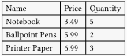
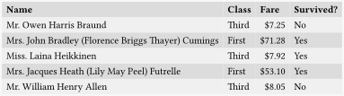
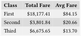

<h1>Tabut</h1>

<em>Powerfull, Simple, Concise</em>

A Typst plugin for turning data into tables.

<h1>Examples</h1>
<h2>Input Format and Creation</h2>

The <code>tabut</code> function takes input in “record” format, an
array of dictionaries, with each dictionary representing a single
“object” or “record”.

In the example below, each record is a listing for an office supply
product.

<pre class="typ"><code>#let supplies = (
  (name: &quot;Notebook&quot;, price: 3.49, quantity: 5),
  (name: &quot;Ballpoint Pens&quot;, price: 5.99, quantity: 2),
  (name: &quot;Printer Paper&quot;, price: 6.99, quantity: 3),
)
</code></pre>

<h2>Basic Table</h2>

Now create a basic table from the data.

<pre class="typ"><code>#import &quot;@preview/tabut:0.0.1&quot;: tabut
#import &quot;example-data/supplies.typ&quot;: supplies

#tabut(
  supplies, // the source of the data used to generate the table
  ( // column definitions
    (
      label: [Name], // label, takes content.
      func: r =&gt; r.name // generates the cell content.
    ), 
    (label: [Price], func: r =&gt; r.price), 
    (label: [Quantity], func: r =&gt; r.quantity), 
  )
)</code></pre>

<code>funct</code> takes a function which generates content for a
given cell corrosponding to the defined column for each record.
<code>r</code> is the record, so <code>r =&gt; r.name</code> returns the
<code>name</code> property of each record in the input data if it has
one.

The philosphy of <code>tabut</code> is that the display of data
should be simple and clearly defined, therefore each column and it’s
content and formatting should be defined within a single clear column
defintion. One consequence is you can comment out, remove or move, any
column easily, for example:

<pre class="typ"><code>#import &quot;@preview/tabut:0.0.1&quot;: tabut
#import &quot;example-data/supplies.typ&quot;: supplies

#tabut(
  supplies,
  (
    (label: [Price], func: r =&gt; r.price), // This column is moved to the front
    (label: [Name], func: r =&gt; r.name), 
    (label: [Name 2], func: r =&gt; r.name), // copied
    // (label: [Quantity], func: r =&gt; r.quantity), // removed via comment
  )
)</code></pre>

<h2>Table Styling</h2>

Any default Table style options can be tacked on and are passed to
the final table function.

<pre class="typ"><code>#import &quot;@preview/tabut:0.0.1&quot;: tabut
#import &quot;example-data/supplies.typ&quot;: supplies

#tabut(
  supplies,
  ( 
    (label: [Name], func: r =&gt; r.name), 
    (label: [Price], func: r =&gt; r.price), 
    (label: [Quantity], func: r =&gt; r.quantity),
  ),
  fill: (_, row) =&gt; if calc.odd(row) { luma(240) } else { luma(220) }, 
  stroke: none
)</code></pre>

<h2>Label Formatting</h2>

You can pass any content or expression into the label property.

<pre class="typ"><code>#import &quot;@preview/tabut:0.0.1&quot;: tabut
#import &quot;example-data/supplies.typ&quot;: supplies

#let fmt(it) = {
  heading(
    outlined: false,
    upper(it)
  )
}

#tabut(
  supplies,
  ( 
    (label: fmt([Name]), func: r =&gt; r.name ), 
    (label: fmt([Price]), func: r =&gt; r.price), 
    (label: fmt([Quantity]), func: r =&gt; r.quantity), 
  ),
  fill: (_, row) =&gt; if calc.odd(row) { luma(240) } else { luma(220) }, 
  stroke: none
)</code></pre>

<h2>Cell Expressions and Formatting</h2>

Just like the labels cell contents can be modified and formatted like
any content in Typst.

<pre class="typ"><code>#import &quot;@preview/tabut:0.0.1&quot;: tabut
#import &quot;usd.typ&quot;: usd
#import &quot;example-data/supplies.typ&quot;: supplies

#tabut(
  supplies,
  ( 
    (label: [*Name*], func: r =&gt; r.name ), 
    (label: [*Price*], func: r =&gt; usd(r.price)), 
  ),
  fill: (_, row) =&gt; if calc.odd(row) { luma(240) } else { luma(220) }, 
  stroke: none
)</code></pre>

You can have the cell content function do calculations on a record
property.

<pre class="typ"><code>#import &quot;@preview/tabut:0.0.1&quot;: tabut
#import &quot;usd.typ&quot;: usd
#import &quot;example-data/supplies.typ&quot;: supplies

#tabut(
  supplies,
  ( 
    (label: [*Name*], func: r =&gt; r.name ), 
    (label: [*Price*], func: r =&gt; usd(r.price)), 
    (label: [*Tax*], func: r =&gt; usd(r.price * .2)), 
    (label: [*Total*], func: r =&gt; usd(r.price * 1.2)), 
  ),
  fill: (_, row) =&gt; if calc.odd(row) { luma(240) } else { luma(220) }, 
  stroke: none
)</code></pre>

Or even combine multiple record properties, go wild.

<pre class="typ"><code>#import &quot;@preview/tabut:0.0.1&quot;: tabut

#let employees = (
    (id: 3251, first: &quot;Alice&quot;, last: &quot;Smith&quot;, middle: &quot;Jane&quot;),
    (id: 4872, first: &quot;Carlos&quot;, last: &quot;Garcia&quot;, middle: &quot;Luis&quot;),
    (id: 5639, first: &quot;Evelyn&quot;, last: &quot;Chen&quot;, middle: &quot;Ming&quot;)
);

#tabut(
  employees,
  ( 
    (label: [*ID*], func: r =&gt; r.id ),
    (label: [*Full Name*], func: r =&gt; [#r.first #r.middle.first(), #r.last] ),
  ),
  fill: (_, row) =&gt; if calc.odd(row) { luma(240) } else { luma(220) }, 
  stroke: none
)</code></pre>

<h2>Index</h2>

<code>tabut</code> automatically adds an <code>_index</code> property
to each record.

<pre class="typ"><code>#import &quot;@preview/tabut:0.0.1&quot;: tabut
#import &quot;example-data/supplies.typ&quot;: supplies

#tabut(
  supplies,
  ( 
    (label: [*\#*], func: r =&gt; r._index),
    (label: [*Name*], func: r =&gt; r.name ), 
  ),
  fill: (_, row) =&gt; if calc.odd(row) { luma(240) } else { luma(220) }, 
  stroke: none
)</code></pre>

<h2>Transpose</h2>

This was annoying to implement, and I don’t know when you’d actually
use this, but here.

<pre class="typ"><code>#import &quot;@preview/tabut:0.0.1&quot;: tabut
#import &quot;usd.typ&quot;: usd
#import &quot;example-data/supplies.typ&quot;: supplies

#tabut(
  supplies,
  (
    (label: [*\#*], func: r =&gt; r._index),
    (label: [*Name*], func: r =&gt; r.name), 
    (label: [*Price*], func: r =&gt; usd(r.price)), 
    (label: [*Quantity*], func: r =&gt; r.quantity),
  ),
  transpose: true,  // set optional name arg `transpose` to `true`
  fill: (_, row) =&gt; if calc.odd(row) { luma(240) } else { luma(220) }, 
  stroke: none
)</code></pre>

<h2>Alignment</h2>

<pre class="typ"><code>#import &quot;@preview/tabut:0.0.1&quot;: tabut
#import &quot;usd.typ&quot;: usd
#import &quot;example-data/supplies.typ&quot;: supplies

#tabut(
  supplies,
  ( // Include `align` as an optional arg to a column def
    (label: [*\#*], func: r =&gt; r._index),
    (label: [*Name*], align: right, func: r =&gt; r.name), 
    (label: [*Price*], align: right, func: r =&gt; usd(r.price)), 
    (label: [*Quantity*], align: right, func: r =&gt; r.quantity),
  ),
  fill: (_, row) =&gt; if calc.odd(row) { luma(240) } else { luma(220) }, 
  stroke: none
)</code></pre>

<h2>Column Width</h2>

<pre class="typ"><code>#import &quot;@preview/tabut:0.0.1&quot;: tabut
#import &quot;usd.typ&quot;: usd
#import &quot;example-data/supplies.typ&quot;: supplies

#box(
  width: 300pt,
  tabut(
    supplies,
    ( // Include `width` as an optional arg to a column def
      (label: [*\#*], func: r =&gt; r._index),
      (label: [*Name*], width: 1fr, func: r =&gt; r.name), 
      (label: [*Price*], width: 20%, func: r =&gt; usd(r.price)), 
      (label: [*Quantity*], width: 1.5in, func: r =&gt; r.quantity),
    ),
    fill: (_, row) =&gt; if calc.odd(row) { luma(240) } else { luma(220) }, 
    stroke: none,
  )
)

</code></pre>

<h1>Data Operation Examples</h1>

While technically seperate from table display, the following are
examples of how to perform operations on data before it is displayed
with <code>tabut</code>.

Since <code>tabut</code> assumes an “array of dictionaries” format,
then most data operations can be performed easily with Typst’s native
array functions. <code>tabut</code> also provides several functions to
provide additional functionality.

<h2>CSV data</h2>

By default, imported CSV gives a “rows” or “array of arrays” data
format, which can not be directly used by <code>tabut</code>. To
convert, <code>tabut</code> includes a function
<code>rows-to-records</code> demonstrated below.

<pre class="typ"><code>#import &quot;@preview/tabut:0.0.1&quot;: tabut, rows-to-records
#import &quot;example-data/supplies.typ&quot;: supplies

#let titanic = {
  let titanic-raw = csv(&quot;example-data/titanic.csv&quot;);
  rows-to-records(
    titanic-raw.first(), // The header row
    titanic-raw.slice(1, -1), // The rest of the rows
  )
}</code></pre>

Imported CSV data are all strings, so it’s usefull to convert them to
<code>int</code> or <code>float</code> when possible.

<pre class="typ"><code>#import &quot;@preview/tabut:0.0.1&quot;: tabut, rows-to-records
#import &quot;example-data/supplies.typ&quot;: supplies

#let auto-type(input) = {
  let is-int = (input.match(regex(&quot;^-?\d+$&quot;)) != none);
  if is-int { return int(input); }
  let is-float = (input.match(regex(&quot;^-?(inf|nan|\d+|\d*(\.\d+))$&quot;)) != none);
  if is-float { return float(input) }
  input
}

#let titanic = {
  let titanic-raw = csv(&quot;example-data/titanic.csv&quot;);
  rows-to-records( titanic-raw.first(), titanic-raw.slice(1, -1) )
  .map( r =&gt; {
    let new-record = (:);
    for (k, v) in r.pairs() { new-record.insert(k, auto-type(v)); }
    new-record
  })
}</code></pre>

<code>tabut</code> includes a function,
<code>records-from-csv</code>, to automatically perform this
process.

<pre class="typ"><code>#import &quot;@preview/tabut:0.0.1&quot;: records-from-csv

#let titanic = records-from-csv(&quot;doc/example-snippets/example-data/titanic.csv&quot;);</code></pre>

<h2><code>slice</code></h2>

<pre class="typ"><code>#import &quot;@preview/tabut:0.0.1&quot;: tabut, records-from-csv
#import &quot;usd.typ&quot;: usd
#import &quot;example-data/titanic.typ&quot;: titanic

#let classes = (
  &quot;N/A&quot;,
  &quot;First&quot;, 
  &quot;Second&quot;, 
  &quot;Third&quot;
);

#let titanic-head = titanic.slice(0, 5);

#tabut(
  titanic-head,
  ( 
    (label: [*Name*], func: r =&gt; r.Name), 
    (label: [*Class*], func: r =&gt; classes.at(r.Pclass)),
    (label: [*Fare*], func: r =&gt; usd(r.Fare)), 
    (label: [*Survived?*], func: r =&gt; (&quot;No&quot;, &quot;Yes&quot;).at(r.Survived)), 
  ),
  fill: (_, row) =&gt; if calc.odd(row) { luma(240) } else { luma(220) }, 
  stroke: none
)</code></pre>

<h2>Sorting and Reversing</h2>

<pre class="typ"><code>#import &quot;@preview/tabut:0.0.1&quot;: tabut
#import &quot;usd.typ&quot;: usd
#import &quot;example-data/titanic.typ&quot;: titanic, classes

#tabut(
  titanic
  .sorted(key: r =&gt; r.Fare)
  .rev()
  .slice(0, 5),
  ( 
    (label: [*Name*], func: r =&gt; r.Name), 
    (label: [*Class*], func: r =&gt; classes.at(r.Pclass)),
    (label: [*Fare*], func: r =&gt; usd(r.Fare)), 
    (label: [*Survived?*], func: r =&gt; (&quot;No&quot;, &quot;Yes&quot;).at(r.Survived)), 
  ),
  fill: (_, row) =&gt; if calc.odd(row) { luma(240) } else { luma(220) }, 
  stroke: none
)</code></pre>

<h2><code>filter</code></h2>

<pre class="typ"><code>#import &quot;@preview/tabut:0.0.1&quot;: tabut
#import &quot;usd.typ&quot;: usd
#import &quot;example-data/titanic.typ&quot;: titanic, classes

#tabut(
  titanic
  .filter(r =&gt; r.Pclass == 1)
  .slice(0, 5),
  ( 
    (label: [*Name*], func: r =&gt; r.Name), 
    (label: [*Class*], func: r =&gt; classes.at(r.Pclass)),
    (label: [*Fare*], func: r =&gt; usd(r.Fare)), 
    (label: [*Survived?*], func: r =&gt; (&quot;No&quot;, &quot;Yes&quot;).at(r.Survived)), 
  ),
  fill: (_, row) =&gt; if calc.odd(row) { luma(240) } else { luma(220) }, 
  stroke: none
)</code></pre>

<h2>Aggregation using <code>map</code> and <code>sum</code></h2>

<pre class="typ"><code>#import &quot;usd.typ&quot;: usd
#import &quot;example-data/titanic.typ&quot;: titanic, classes

#table(
  columns: (auto, auto),
  [*Fare, Total:*], [#usd(titanic.map(r =&gt; r.Fare).sum())],
  [*Fare, Avg:*], [#usd(titanic.map(r =&gt; r.Fare).sum() / titanic.len())], 
  stroke: none
)</code></pre>

<h2>Grouping</h2>

<pre class="typ"><code>#import &quot;@preview/tabut:0.0.1&quot;: tabut, group
#import &quot;example-data/titanic.typ&quot;: titanic, classes

#tabut(
  group(titanic, r =&gt; r.Pclass),
  (
    (label: [*Class*], func: r =&gt; classes.at(r.value)), 
    (label: [*Passengers*], func: r =&gt; r.group.len()), 
  ),
  fill: (_, row) =&gt; if calc.odd(row) { luma(240) } else { luma(220) }, 
  stroke: none
)</code></pre>

<pre class="typ"><code>#import &quot;@preview/tabut:0.0.1&quot;: tabut, group
#import &quot;usd.typ&quot;: usd
#import &quot;example-data/titanic.typ&quot;: titanic, classes

#tabut(
  group(titanic, r =&gt; r.Pclass),
  (
    (label: [*Class*], func: r =&gt; classes.at(r.value)), 
    (label: [*Total Fare*], func: r =&gt; usd(r.group.map(r =&gt; r.Fare).sum())), 
    (
      label: [*Avg Fare*], 
      func: r =&gt; usd(r.group.map(r =&gt; r.Fare).sum() / r.group.len())
    ), 
  ),
  fill: (_, row) =&gt; if calc.odd(row) { luma(240) } else { luma(220) }, 
  stroke: none
)</code></pre>

