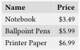
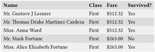
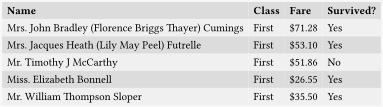

<div>

# Tabut <span id="tabut"></span>

*Powerful, Simple, Concise*

A Typst plugin for turning data into tables.

## Outline

- [Examples](#examples)

  - [Input Format and Creation](#input-format-and-creation)

  - [Basic Table](#basic-table)

  - [Table Styling](#table-styling)

  - [Header Formatting](#header-formatting)

  - [Remove Headers](#remove-headers)

  - [Cell Expressions and Formatting](#cell-expressions-and-formatting)

  - [Index](#index)

  - [Transpose](#transpose)

  - [Alignment](#alignment)

  - [Column Width](#column-width)

  - [Get Cells Only](#get-cells-only)

  - [Use with Tablex](#use-with-tablex)

- [Data Operation Examples](#data-operation-examples)

  - [CSV Data](#csv-data)

  - [Slice](#slice)

  - [Sorting and Reversing](#sorting-and-reversing)

  - [Filter](#filter)

  - [Aggregation using Map and Sum](#aggregation-using-map-and-sum)

  - [Grouping](#grouping)

</div>

<div>

# Examples <span id="examples"></span>

</div>

<div>

## Input Format and Creation <span id="input-format-and-creation"></span>

The `tabut` function takes input in “record” format, an array of
dictionaries, with each dictionary representing a single “object” or
“record”.

In the example below, each record is a listing for an office supply
product.

<div>

``` typ
#let supplies = (
  (name: "Notebook", price: 3.49, quantity: 5),
  (name: "Ballpoint Pens", price: 5.99, quantity: 2),
  (name: "Printer Paper", price: 6.99, quantity: 3),
)
```

</div>

</div>

<div>

## Basic Table <span id="basic-table"></span>

Now create a basic table from the data.

<div>

``` typ
#import "@preview/tabut:0.0.1": tabut
#import "example-data/supplies.typ": supplies

#tabut(
  supplies, // the source of the data used to generate the table
  ( // column definitions
    (
      header: [Name], // label, takes content.
      func: r => r.name // generates the cell content.
    ), 
    (header: [Price], func: r => r.price), 
    (header: [Quantity], func: r => r.quantity), 
  )
)
```

</div>

<div>


</div>

`funct` takes a function which generates content for a given cell
corrosponding to the defined column for each record. `r` is the record,
so `r => r.name` returns the `name` property of each record in the input
data if it has one.

</div>

<div>

The philosphy of `tabut` is that the display of data should be simple
and clearly defined, therefore each column and it’s content and
formatting should be defined within a single clear column defintion. One
consequence is you can comment out, remove or move, any column easily,
for example:

<div>

``` typ
#import "@preview/tabut:0.0.1": tabut
#import "example-data/supplies.typ": supplies

#tabut(
  supplies,
  (
    (header: [Price], func: r => r.price), // This column is moved to the front
    (header: [Name], func: r => r.name), 
    (header: [Name 2], func: r => r.name), // copied
    // (header: [Quantity], func: r => r.quantity), // removed via comment
  )
)
```

</div>

<div>


</div>

</div>

<div>

## Table Styling <span id="table-styling"></span>

Any default Table style options can be tacked on and are passed to the
final table function.

<div>

``` typ
#import "@preview/tabut:0.0.1": tabut
#import "example-data/supplies.typ": supplies

#tabut(
  supplies,
  ( 
    (header: [Name], func: r => r.name), 
    (header: [Price], func: r => r.price), 
    (header: [Quantity], func: r => r.quantity),
  ),
  fill: (_, row) => if calc.odd(row) { luma(240) } else { luma(220) }, 
  stroke: none
)
```

</div>

<div>


</div>

</div>

<div>

## Header Formatting <span id="header-formatting"></span>

You can pass any content or expression into the header property.

<div>

``` typ
#import "@preview/tabut:0.0.1": tabut
#import "example-data/supplies.typ": supplies

#let fmt(it) = {
  heading(
    outlined: false,
    upper(it)
  )
}

#tabut(
  supplies,
  ( 
    (header: fmt([Name]), func: r => r.name ), 
    (header: fmt([Price]), func: r => r.price), 
    (header: fmt([Quantity]), func: r => r.quantity), 
  ),
  fill: (_, row) => if calc.odd(row) { luma(240) } else { luma(220) }, 
  stroke: none
)
```

</div>

<div>


</div>

</div>

<div>

## Remove Headers <span id="remove-headers"></span>

You can prevent from being generated with the `headers` paramater. This
is useful with the `tabut-cells` function as demonstrated in it’s
section.

<div>

``` typ
#import "@preview/tabut:0.0.1": tabut
#import "example-data/supplies.typ": supplies

#tabut(
  supplies,
  (
    (header: [*Name*], func: r => r.name), 
    (header: [*Price*], func: r => r.price), 
    (header: [*Quantity*], func: r => r.quantity), 
  ),
  headers: false, // Prevents Headers from being generated
  fill: (_, row) => if calc.odd(row) { luma(240) } else { luma(220) }, 
  stroke: none,
)
```

</div>

<div>


</div>

</div>

<div>

## Cell Expressions and Formatting <span id="cell-expressions-and-formatting"></span>

Just like the headers, cell contents can be modified and formatted like
any content in Typst.

<div>

``` typ
#import "@preview/tabut:0.0.1": tabut
#import "usd.typ": usd
#import "example-data/supplies.typ": supplies

#tabut(
  supplies,
  ( 
    (header: [*Name*], func: r => r.name ), 
    (header: [*Price*], func: r => usd(r.price)), 
  ),
  fill: (_, row) => if calc.odd(row) { luma(240) } else { luma(220) }, 
  stroke: none
)
```

</div>

<div>



</div>

</div>

<div>

You can have the cell content function do calculations on a record
property.

<div>

``` typ
#import "@preview/tabut:0.0.1": tabut
#import "usd.typ": usd
#import "example-data/supplies.typ": supplies

#tabut(
  supplies,
  ( 
    (header: [*Name*], func: r => r.name ), 
    (header: [*Price*], func: r => usd(r.price)), 
    (header: [*Tax*], func: r => usd(r.price * .2)), 
    (header: [*Total*], func: r => usd(r.price * 1.2)), 
  ),
  fill: (_, row) => if calc.odd(row) { luma(240) } else { luma(220) }, 
  stroke: none
)
```

</div>

<div>


</div>

</div>

<div>

Or even combine multiple record properties, go wild.

<div>

``` typ
#import "@preview/tabut:0.0.1": tabut

#let employees = (
    (id: 3251, first: "Alice", last: "Smith", middle: "Jane"),
    (id: 4872, first: "Carlos", last: "Garcia", middle: "Luis"),
    (id: 5639, first: "Evelyn", last: "Chen", middle: "Ming")
);

#tabut(
  employees,
  ( 
    (header: [*ID*], func: r => r.id ),
    (header: [*Full Name*], func: r => [#r.first #r.middle.first(), #r.last] ),
  ),
  fill: (_, row) => if calc.odd(row) { luma(240) } else { luma(220) }, 
  stroke: none
)
```

</div>

<div>


</div>

</div>

<div>

## Index <span id="index"></span>

`tabut` automatically adds an `_index` property to each record.

<div>

``` typ
#import "@preview/tabut:0.0.1": tabut
#import "example-data/supplies.typ": supplies

#tabut(
  supplies,
  ( 
    (header: [*\#*], func: r => r._index),
    (header: [*Name*], func: r => r.name ), 
  ),
  fill: (_, row) => if calc.odd(row) { luma(240) } else { luma(220) }, 
  stroke: none
)
```

</div>

<div>


</div>

You can also prevent the `index` property being generated by setting it
to `none`, or you can also set an alternate name of the index property
as shown below.

<div>

``` typ
#import "@preview/tabut:0.0.1": tabut
#import "example-data/supplies.typ": supplies

#tabut(
  supplies,
  ( 
    (header: [*\#*], func: r => r.index-alt ),
    (header: [*Name*], func: r => r.name ), 
  ),
  index: "index-alt", // set an aternate name for the automatically generated index property.
  fill: (_, row) => if calc.odd(row) { luma(240) } else { luma(220) }, 
  stroke: none
)
```

</div>

<div>


</div>

</div>

<div>

## Transpose <span id="transpose"></span>

This was annoying to implement, and I don’t know when you’d actually use
this, but here.

<div>

``` typ
#import "@preview/tabut:0.0.1": tabut
#import "usd.typ": usd
#import "example-data/supplies.typ": supplies

#tabut(
  supplies,
  (
    (header: [*\#*], func: r => r._index),
    (header: [*Name*], func: r => r.name), 
    (header: [*Price*], func: r => usd(r.price)), 
    (header: [*Quantity*], func: r => r.quantity),
  ),
  transpose: true,  // set optional name arg `transpose` to `true`
  fill: (_, row) => if calc.odd(row) { luma(240) } else { luma(220) }, 
  stroke: none
)
```

</div>

<div>


</div>

</div>

<div>

## Alignment <span id="alignment"></span>

<div>

``` typ
#import "@preview/tabut:0.0.1": tabut
#import "usd.typ": usd
#import "example-data/supplies.typ": supplies

#tabut(
  supplies,
  ( // Include `align` as an optional arg to a column def
    (header: [*\#*], func: r => r._index),
    (header: [*Name*], align: right, func: r => r.name), 
    (header: [*Price*], align: right, func: r => usd(r.price)), 
    (header: [*Quantity*], align: right, func: r => r.quantity),
  ),
  fill: (_, row) => if calc.odd(row) { luma(240) } else { luma(220) }, 
  stroke: none
)
```

</div>

<div>


</div>

You can also define Alignment manually as in the the standard Table
Function.

<div>

``` typ
#import "@preview/tabut:0.0.1": tabut
#import "usd.typ": usd
#import "example-data/supplies.typ": supplies

#tabut(
  supplies,
  ( 
    (header: [*\#*], func: r => r._index),
    (header: [*Name*], func: r => r.name), 
    (header: [*Price*], func: r => usd(r.price)), 
    (header: [*Quantity*], func: r => r.quantity),
  ),
  align: (auto, right, right, right), // Alignment defined as in standard table function
  fill: (_, row) => if calc.odd(row) { luma(240) } else { luma(220) }, 
  stroke: none
)
```

</div>

<div>


</div>

</div>

<div>

## Column Width <span id="column-width"></span>

<div>

``` typ
#import "@preview/tabut:0.0.1": tabut
#import "usd.typ": usd
#import "example-data/supplies.typ": supplies

#box(
  width: 300pt,
  tabut(
    supplies,
    ( // Include `width` as an optional arg to a column def
      (header: [*\#*], func: r => r._index),
      (header: [*Name*], width: 1fr, func: r => r.name), 
      (header: [*Price*], width: 20%, func: r => usd(r.price)), 
      (header: [*Quantity*], width: 1.5in, func: r => r.quantity),
    ),
    fill: (_, row) => if calc.odd(row) { luma(240) } else { luma(220) }, 
    stroke: none,
  )
)

```

</div>

<div>


</div>

You can also define Columns manually as in the the standard Table
Function.

<div>

``` typ
#import "@preview/tabut:0.0.1": tabut
#import "usd.typ": usd
#import "example-data/supplies.typ": supplies

#box(
  width: 300pt,
  tabut(
    supplies,
    (
      (header: [*\#*], func: r => r._index),
      (header: [*Name*], func: r => r.name), 
      (header: [*Price*], func: r => usd(r.price)), 
      (header: [*Quantity*], func: r => r.quantity),
    ),
    columns: (auto, 1fr, 20%, 1.5in),  // Columns defined as in standard table
    fill: (_, row) => if calc.odd(row) { luma(240) } else { luma(220) }, 
    stroke: none,
  )
)

```

</div>

<div>


</div>

</div>

<div>

## Get Cells Only <span id="get-cells-only"></span>

<div>

``` typ
#import "@preview/tabut:0.0.1": tabut-cells
#import "usd.typ": usd
#import "example-data/supplies.typ": supplies

#tabut-cells(
  supplies,
  ( 
    (header: [Name], func: r => r.name), 
    (header: [Price], func: r => usd(r.price)), 
    (header: [Quantity], func: r => r.quantity),
  )
)
```

</div>

<div>


</div>

</div>

<div>

## Use with Tablex <span id="use-with-tablex"></span>

<div>

``` typ
#import "@preview/tabut:0.0.1": tabut-cells
#import "usd.typ": usd
#import "example-data/supplies.typ": supplies

#import "@preview/tablex:0.0.8": tablex, rowspanx, colspanx

#tablex(
  auto-vlines: false,
  header-rows: 2,

  /* --- header --- */
  rowspanx(2)[*Name*], colspanx(2)[*Price*], (), rowspanx(2)[*Quantity*],
  (),                 [*Base*], [*W/Tax*], (),
  /* -------------- */

  ..tabut-cells(
    supplies,
    ( 
      (header: [], func: r => r.name), 
      (header: [], func: r => usd(r.price)), 
      (header: [], func: r => usd(r.price * 1.3)), 
      (header: [], func: r => r.quantity),
    ),
    headers: false
  )
)
```

</div>

<div>


</div>

</div>

<div>

# Data Operation Examples <span id="data-operation-examples"></span>

While technically seperate from table display, the following are
examples of how to perform operations on data before it is displayed
with `tabut`.

Since `tabut` assumes an “array of dictionaries” format, then most data
operations can be performed easily with Typst’s native array functions.
`tabut` also provides several functions to provide additional
functionality.

</div>

<div>

## CSV Data <span id="csv-data"></span>

By default, imported CSV gives a “rows” or “array of arrays” data
format, which can not be directly used by `tabut`. To convert, `tabut`
includes a function `rows-to-records` demonstrated below.

<div>

``` typ
#import "@preview/tabut:0.0.1": tabut, rows-to-records
#import "example-data/supplies.typ": supplies

#let titanic = {
  let titanic-raw = csv("example-data/titanic.csv");
  rows-to-records(
    titanic-raw.first(), // The header row
    titanic-raw.slice(1, -1), // The rest of the rows
  )
}
```

</div>

Imported CSV data are all strings, so it’s usefull to convert them to
`int` or `float` when possible.

<div>

``` typ
#import "@preview/tabut:0.0.1": tabut, rows-to-records
#import "example-data/supplies.typ": supplies

#let auto-type(input) = {
  let is-int = (input.match(regex("^-?\d+$")) != none);
  if is-int { return int(input); }
  let is-float = (input.match(regex("^-?(inf|nan|\d+|\d*(\.\d+))$")) != none);
  if is-float { return float(input) }
  input
}

#let titanic = {
  let titanic-raw = csv("example-data/titanic.csv");
  rows-to-records( titanic-raw.first(), titanic-raw.slice(1, -1) )
  .map( r => {
    let new-record = (:);
    for (k, v) in r.pairs() { new-record.insert(k, auto-type(v)); }
    new-record
  })
}
```

</div>

`tabut` includes a function, `records-from-csv`, to automatically
perform this process.

<div>

``` typ
#import "@preview/tabut:0.0.1": records-from-csv

#let titanic = records-from-csv("doc/example-snippets/example-data/titanic.csv");
```

</div>

</div>

<div>

## Slice <span id="slice"></span>

<div>

``` typ
#import "@preview/tabut:0.0.1": tabut, records-from-csv
#import "usd.typ": usd
#import "example-data/titanic.typ": titanic

#let classes = (
  "N/A",
  "First", 
  "Second", 
  "Third"
);

#let titanic-head = titanic.slice(0, 5);

#tabut(
  titanic-head,
  ( 
    (header: [*Name*], func: r => r.Name), 
    (header: [*Class*], func: r => classes.at(r.Pclass)),
    (header: [*Fare*], func: r => usd(r.Fare)), 
    (header: [*Survived?*], func: r => ("No", "Yes").at(r.Survived)), 
  ),
  fill: (_, row) => if calc.odd(row) { luma(240) } else { luma(220) }, 
  stroke: none
)
```

</div>

<div>


</div>

</div>

<div>

## Sorting and Reversing <span id="sorting-and-reversing"></span>

<div>

``` typ
#import "@preview/tabut:0.0.1": tabut
#import "usd.typ": usd
#import "example-data/titanic.typ": titanic, classes

#tabut(
  titanic
  .sorted(key: r => r.Fare)
  .rev()
  .slice(0, 5),
  ( 
    (header: [*Name*], func: r => r.Name), 
    (header: [*Class*], func: r => classes.at(r.Pclass)),
    (header: [*Fare*], func: r => usd(r.Fare)), 
    (header: [*Survived?*], func: r => ("No", "Yes").at(r.Survived)), 
  ),
  fill: (_, row) => if calc.odd(row) { luma(240) } else { luma(220) }, 
  stroke: none
)
```

</div>

<div>



</div>

</div>

<div>

## Filter <span id="filter"></span>

<div>

``` typ
#import "@preview/tabut:0.0.1": tabut
#import "usd.typ": usd
#import "example-data/titanic.typ": titanic, classes

#tabut(
  titanic
  .filter(r => r.Pclass == 1)
  .slice(0, 5),
  ( 
    (header: [*Name*], func: r => r.Name), 
    (header: [*Class*], func: r => classes.at(r.Pclass)),
    (header: [*Fare*], func: r => usd(r.Fare)), 
    (header: [*Survived?*], func: r => ("No", "Yes").at(r.Survived)), 
  ),
  fill: (_, row) => if calc.odd(row) { luma(240) } else { luma(220) }, 
  stroke: none
)
```

</div>

<div>



</div>

</div>

<div>

## Aggregation using Map and Sum <span id="aggregation-using-map-and-sum"></span>

<div>

``` typ
#import "usd.typ": usd
#import "example-data/titanic.typ": titanic, classes

#table(
  columns: (auto, auto),
  [*Fare, Total:*], [#usd(titanic.map(r => r.Fare).sum())],
  [*Fare, Avg:*], [#usd(titanic.map(r => r.Fare).sum() / titanic.len())], 
  stroke: none
)
```

</div>

<div>


</div>

</div>

<div>

## Grouping <span id="grouping"></span>

<div>

``` typ
#import "@preview/tabut:0.0.1": tabut, group
#import "example-data/titanic.typ": titanic, classes

#tabut(
  group(titanic, r => r.Pclass),
  (
    (header: [*Class*], func: r => classes.at(r.value)), 
    (header: [*Passengers*], func: r => r.group.len()), 
  ),
  fill: (_, row) => if calc.odd(row) { luma(240) } else { luma(220) }, 
  stroke: none
)
```

</div>

<div>


</div>

<div>

``` typ
#import "@preview/tabut:0.0.1": tabut, group
#import "usd.typ": usd
#import "example-data/titanic.typ": titanic, classes

#tabut(
  group(titanic, r => r.Pclass),
  (
    (header: [*Class*], func: r => classes.at(r.value)), 
    (header: [*Total Fare*], func: r => usd(r.group.map(r => r.Fare).sum())), 
    (
      header: [*Avg Fare*], 
      func: r => usd(r.group.map(r => r.Fare).sum() / r.group.len())
    ), 
  ),
  fill: (_, row) => if calc.odd(row) { luma(240) } else { luma(220) }, 
  stroke: none
)
```

</div>

<div>


</div>

</div>
